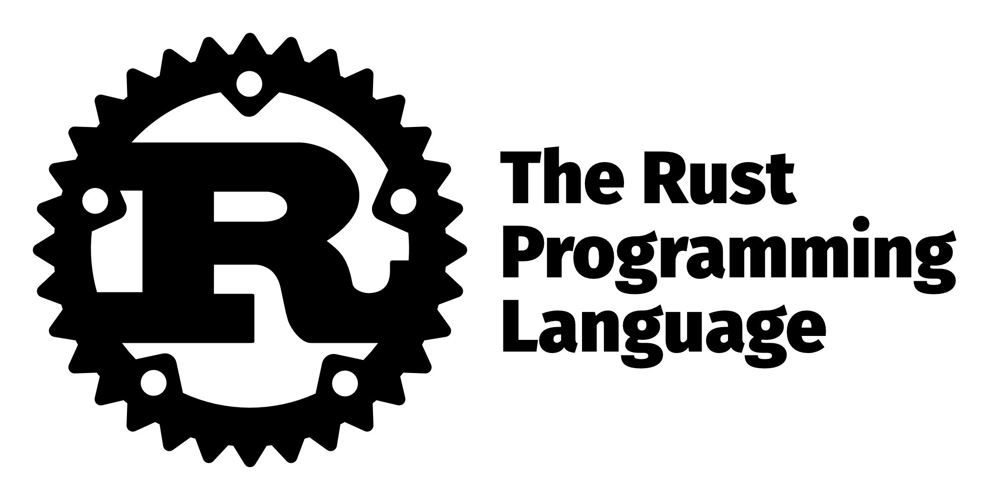

# Rust

Workshop for beginners

 <!-- .element: height="50" -->

Note: Welcome to our Rust beginner workshop. We'll start with a quick intro
to hopefully answer most of the organizational questions. 

---

## When?

- Tuesday to Friday
- 1pm to 6pm CEST with breaks in between

---

## Where?

[https://us06web.zoom.us/meeting/register/tZM…](https://us06web.zoom.us/meeting/register/tZMkceugpzorHNK76D3A9D_IFYhNR42mL3tX)

Note: Since you're all here, I assume this link is not a surprise to you. 

---

## What?

Note: What do we want to talk about and work on in this workshop?

----

 <!-- .element: height="300" -->

Note: As the name says, this workshop is all about the Rust programming language.

----

We want to teach you:

- basics of the language
- overview of the ecosystem
- high-level overview of the more complex parts

----

The workshop will consist of three things:

- Lectures
- Quizzes
- Exercises

---

## Who?

----

**Tobias Bieniek**

- GitHub: [@Turbo87](https://github.com/Turbo87)
- Twitter: [@TobiasBieniek](https://twitter.com/TobiasBieniek)

----

 <!-- .element: height="600" -->

----

 <!-- .element: height="600" -->

----

**Tobias Bieniek**

- Involved with Rust since 2015
- Joined crates.io team in 2019
- Co-lead of crates.io team since 2021
- Working for simplabs since 2017

----

 <!-- .element: height="50" -->

https://simplabs.com/

- Founded in 2015
- Fullstack consulting and team augmentation,  
  originally with focus on Ember.js and Ruby on Rails
- These days also: Elixir, Rust, React, Vue, etc.

---

## Who are you?

----

- Where are you from?
- Who do you work for?
- How long have you been doing software development?
- What languages do you work with?
- What software development area are you working in?
- What operating system do you use?

---

## Feedback

We want to improve. Please give us feedback!

https://forms.gle/Axv5BdQKSB44NJAQ7

---

[Table of Contents](./README.md#/0/1)
